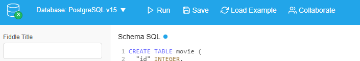

# Pratique du SQL

Nous allons ensemble s'initier au SQL, en passant par une interface web afin de nous concentrer sur l'essentiel.

## :zero: Interface DB-Fiddle

Tout l'atelier se déroule sur le site [db-fiddle.com](https://www.db-fiddle.com/).

Avant d'utiliser cette interface, assurez-vous d'avoir sélectionné en haut à gauche la bonne version de SGBD (DBMS) : **PostgreSQL v15**



## :one: Découverte du CRUD avec la table Movie

Rendez-vous sur cette interface avec un schema déjà pré-rempli : [movie-crud](https://www.db-fiddle.com/f/xaRUGCADPhzQZ1ejLiYJPk/2)

### Lecture avec `SELECT`

#### 1. Mes premières sélections

```sql
SELECT 'Hello World!';
```
```sql
SELECT 123;
```
```sql
SELECT NOW();
```

Ou les trois en même temps, du moment qu'elles sont bien terminées par un `;` :

```sql
SELECT 'Hello World!';-- je sélectionne la chaîne de caractères littérale 'Hello World!'
SELECT 123;-- je sélectionne le nombre entier 123
SELECT NOW();-- je sélectionne la date et l'heure actuelles

```

#### 2. Sélections sur la table movie

**2.a. Observez les différences de résultats pour les trois requêtes.**

```sql
SELECT * FROM "movie"; 
-- je sélectionne toutes les colonnes de la table "movie"
SELECT "title" FROM "movie";
-- je sélectionne uniquement la colonne "title" de la table "movie"
SELECT "id", "title" FROM "movie";
-- je sélectionne les colonnes "id" et "title" de la table "movie"
```
> Où se situe la différence ?
```sql
`reponse`--  la différence réside dans le nombre et le type de colonnes sélectionnées dans chaque requête.
```
**2.b. Observez les différences de résultats pour les trois requêtes.**

```sql
SELECT * FROM "movie" WHERE "id" = 2;
-- je sélectionne toutes les colonnes de la table "movie" ou l'identifiant est egale a  '2'.
SELECT "country_name", "title", "id", "rate" FROM "movie" WHERE "id" = 2;
-- je sélectionne la colonne "country_name", "title", "id", "rate" de la table "movie"ou l'identifiant est egale a '2'.
SELECT "rate", "title" FROM "movie" WHERE "id" = 2;
-- je sélectionne la colonne "rate","title" de la table "movie"ou l'identifiant est egale a '2'
```
> Où se situe la différence ?
```sql
-- la différence réside dans le nombre et le type de colonnes sélectionnées dans chaque requête, ainsi que dans les conditions spécifiées (ici l'id étant égal à 2).
``` 

**2.c. Observez les différences de résultats pour les trois requêtes.**

```sql
SELECT * FROM "movie" WHERE "title" = 'Les visiteurs';
-- -- je sélectionne toutes les colonnes de la table "movie" où le titre est égal à 'Les visiteurs'
SELECT * FROM "movie" WHERE "rate" >= 4;
-- -- je sélectionne toutes les colonnes de la table "movie" où la note (rate) est supérieure ou égale à 4
SELECT * FROM "movie" WHERE "country_name" = 'France';
-- je sélectionne toutes les colonnes de la table "movie" où le nom du pays (country_name) est égal à 'France'
> Où se situe la différence ?
-- la différence réside dans les conditions spécifiées dans chaque requête 
```


> Ecrire une requête qui récupère tous les titres des films français

```sql

SELECT "title"
 FROM "movie" 
 WHERE "country_name" = 'France';

--je sélectionne les titres de la table "movie" où le nom du pays est 'France'. 

```

### Création avec `INSERT INTO`

**1. Observez les différences de résultats pour les trois requêtes.**
```sql
SELECT * FROM "movie";
---- je sélectionne toutes les colonnes de la table "movie"
INSERT INTO "movie"
  ("id","title", "rate", "country_name")
  ---- j'insère une nouvelle ligne dans la table "movie" avec les valeurs spécifiées

VALUES
  ('8','Les vacances de Mr Bean', 1, 'Royaume-uni');

--
SELECT * FROM "movie";
-- je sélectionne toutes les colonnes de la table "movie" à nouveau pour observer les changements
> Que s''est-il passé entre les deux requêtes de sélection ?
-- j'entre les deux requêtes de sélection, une nouvelle ligne a été insérée dans la table "movie".
-- Cette ligne contient les informations suivantes : 
-- titre : 'Les vacances de Mr Bean', 
-- note : 1, 
-- pays : 'Royaume-uni'.
-- Id : 8
-- La deuxième requête de sélection montre la table "movie" avec cette nouvelle ligne ajoutée.
```


**2. Observez les différences de résultats pour les trois requêtes.**
```sql
SELECT * FROM "movie";
---- je sélectionne toutes les colonnes de la table "movie"


INSERT INTO "movie"
  ("title", "country_name")
  -- j'insère une nouvelle ligne dans la table "movie" avec les valeurs spécifiées"title", "country_name"

VALUES
  ('La communauté de l''anneaux', 'Etats-unis'),
  ('Les deux tours', 'Etats-unis'),
  ('Le retour du roi', 'Etats-unis');
--
SELECT * FROM "movie";
-- je sélectionne toutes les colonnes de la table "movie" à nouveau pour observer les changements


> Que s''est-il passé entre les deux requêtes de sélection ?
-- Entre les deux requêtes de sélection, trois nouvelles lignes ont été insérées dans la table "movie".
-- Ces lignes contiennent les informations suivantes :
-- titre : 'La communauté de l''anneaux', pays : 'Etats-unis'
-- titre : 'Les deux tours', pays : 'Etats-unis'
-- titre : 'Le retour du roi', pays : 'Etats-unis'
-- La deuxième requête de sélection montre la table "movie" avec ces nouvelles lignes ajoutées.
```


> Ecrire une requête pour ajouter le film de votre choix...

```sql
SELECT * FROM "movie";
INSERT INTO "movie"
  ("title", "rate", "country_name")
VALUES
  ('kickboxer: vengeance', 5, 'Etats-unis');
SELECT * FROM "movie";
```

### Mise à jour avec `UPDATE`

**1. Observez les différences de résultats pour les trois requêtes.**
```sql
SELECT * FROM "movie";
-- je selectionne toutes les colonnes de la table "movie"

--
UPDATE "movie"
SET "country_name" = 'Canada';
-- Met à jour la colonne "country_name" pour toutes les lignes de la table "movie", en changeant sa valeur en 'Canada'

--
SELECT * FROM "movie";
-- je sélectionne toutes les colonnes de la table "movie" à nouveau pour observer les changements
> Que s''est-il passé entre les deux requêtes de sélection ?
--la requête UPDATE a modifié toutes les valeurs de la colonne country_name dans la table "movie" en les remplaçant par 'Canada', toutes les entrées de la table "movie" auront maintenant 'Canada' comme valeur pour la colonne country_name.
```


**2. Observez les différences de résultats pour les trois requêtes.**
```sql
SELECT * FROM "movie";
-- je sélectionne toutes les colonnes de la table "movie"
--
UPDATE "movie"
SET "rate" = "rate" * 10;
-- je met à jour la colonne rate en la multipliant fois 10
SELECT * FROM "movie";
-- je sélectionne toutes les colonnes de la table "movie" à nouveau pour observer les changements
> Que s''est-il passé entre les deux requêtes de sélection ?
--la requête UPDATE a modifié toutes les valeurs de la colonne rate en la multipliant le rate par 10  
```


> Comment faire pour modifier la valeur de la note du film The mask seulement ?

```sql
-- Je sélectionne toutes les colonnes de la table "movie" pour voir les données actuelles
SELECT * FROM "movie";
-- Je mets à jour la note du film (rate) en la définissant à 4 pour le film dont l'identifiant (id) est 5
UPDATE "movie"
SET 
  "rate" = 4
  -- Je m'assure que seule la ligne avec l'identifiant 5 est mise à jour
WHERE "id" = 5; 
-- Je sélectionne à nouveau toutes les colonnes de la table "movie" pour vérifier les modifications
SELECT * FROM "movie";
```

### Suppression avec `DELETE FROM`
**Observez les différences de résultats pour les trois requêtes.**
```sql
SELECT * FROM "movie";
-- Je sélectionne toutes les colonnes de la table "movie" pour voir les données actuelles
DELETE FROM "movie"
-- Je supprime les lignes de la table "movie" où le nom du pays (country_name) est 'France'
WHERE "country_name" = 'France';
-- Je sélectionne à nouveau toutes les colonnes de la table "movie" pour vérifier les modifications
SELECT * FROM "movie";
> Que s''est-il passé entre les deux requêtes de sélection ?
-- la function Delete a supprimé tout les filmes francais .
```


> Comment faire pour supprimer tous les films français ?

```sql
SELECT * FROM "movie";
--
DELETE FROM "movie"
WHERE "country_name"= 'France';
--
SELECT * FROM "movie";

```

## :two: Pratiquer avec les tables Album et Artist

Rendez-vous sur cette interface avec un schema déjà pré-rempli : [album-select](https://www.db-fiddle.com/f/dKimjZpSYveTcKPNXZ2gtD/2)

### 1. Queen

- Ecrire la requête qui permettra de trouver `l''identifiant` de Queen

```sql
SELECT "ArtistId" FROM "Artist" WHERE "Name" = 'Queen';

-- Je sélectionne la colonne "ArtistId" de la table "Artist"
-- Je spécifie la table "Artist" dans laquelle chercher
-- Je filtre les résultats pour n'obtenir que la ligne où le nom de l'artiste ("Name") est égal à 'Queen'
```

- Ecrire la requête qui permettra de trouver tous les albums de Queen

```sql
-- Je sélectionne toutes les colonnes de la table "Album"
SELECT *
-- Je spécifie la table "Album" dans laquelle chercher
FROM "Album"
-- Je filtre les résultats pour n'obtenir que les albums dont l'ArtistId correspond à celui de 'Queen'
WHERE "ArtistId" = (
  -- Je sélectionne l'ArtistId de l'artiste 'Queen' dans la table "Artist"
  SELECT "ArtistId"
  FROM "Artist"
  WHERE "Name" = 'Queen'
);
```

### 2. Houses Of The Holy

- Ecrire la requête qui permettra de trouver `"l'identifiant" `de l'artiste de`"l'album"` qui a pour `titre` 'Houses Of The Holy'

```sql

-- Je sélectionne l'identifiant de l'artiste (ArtistId) de la table "Album"
SELECT "ArtistId"
-- Je spécifie la table "Album" dans laquelle chercher
FROM "Album"
-- Je filtre les résultats pour n'obtenir que la ligne où le titre de l'album ("Title") est égal à 'Houses Of The Holy'
WHERE "Title" = 'Houses Of The Holy';

SELECT "ArtistId"
FROM "Album"
WHERE "Title" = 'Houses Of The Holy';

```

- Ecrire la requête qui permettra de trouver `le nom de l'artiste`de `l''album` qui a pour `titre` 'Houses Of The Holy'

```sql
-- Je sélectionne la colonne "Name" de la table "Artist"
SELECT "Name"
-- Je spécifie la table "Artist" dans laquelle chercher
FROM "Artist"
-- Je filtre les résultats pour n'obtenir que la ligne où l'identifiant de l'artiste ("ArtistId") est égal à 22
WHERE "ArtistId" = 22;


```

### 3. Live

D'abord, consultez ce tutoriel : [postgreSQL Tutorial](https://www.postgresqltutorial.com/postgresql-tutorial/postgresql-like/).

A partir de cette lecture, tentez de sélectionner tous les albums qui contiennent la chaine de caractères 'Live' dans leur titre.

```sql
SELECT * FROM "Album" WHERE "Title" LIKE '%Live%';
-- Je sélectionne toutes les colonnes de la table "Album" pour obtenir les détails des albums
--SELECT *
-- Je spécifie la table "Album" dans laquelle chercher
--FROM "Album"
-- Je filtre les résultats pour n'obtenir que les lignes où le titre de l'album ("Title") contient la chaîne de caractères 'Live'
--WHERE "Title" LIKE '%Live%';

```

Tentez maintenant de sélectionner tous les albums dont le titre commence par 'The '.

```sql
SELECT * FROM "Album" WHERE "Title" LIKE 'The %';
-- Je sélectionne toutes les colonnes de la table "Album" pour obtenir les détails des albums
SELECT *
-- Je spécifie la table "Album" dans laquelle chercher
FROM "Album"
-- Je filtre les résultats pour n'obtenir que les lignes où le titre de l'album ("Title") commence par 'The '
WHERE "Title" LIKE 'The %';


```

### 4. Amy Winehouse OU Calexico

D'abord, consultez les parties 1, 2, 3 de ce tutoriel : [postgreSQL Tutorial](https://www.postgresqltutorial.com/postgresql-tutorial/postgresql-where/).

A partir de cette lecture, tentez de sélectionner tous les albums qui appartiennent à Amy Winehouse ou à Calexico.

```sql
-- Je dois connaitre les ID des artistes 'Amy Winehouse' et 'Calexico'
-- Je sélectionne la colonne "ArtistId" de la table "Artist"
SELECT "ArtistId"
-- Je spécifie la table "Artist" dans laquelle chercher
FROM "Artist"
-- Je filtre les résultats pour n'obtenir que les lignes où le nom de l'artiste ("Name") est égal à 'Amy Winehouse' ou 'Calexico'
WHERE "Name" = 'Amy Winehouse' OR "Name" = 'Calexico';

-- Alternative avec IN
SELECT "ArtistId"
FROM "Artist"
-- Je filtre les résultats pour n'obtenir que les lignes où le nom de l'artiste ("Name") est dans la liste ('Amy Winehouse', 'Calexico')
WHERE "Name" IN('Amy Winehouse','Calexico');

-- Une fois que j'ai leurs IDs, je peux faire ma requête pour connaitre les albums associés
-- Je sélectionne les titres des albums de la table "Album"
SELECT "Title"
-- Je spécifie la table "Album" dans laquelle chercher
FROM "Album"
-- Je filtre les résultats pour n'obtenir que les albums dont l'ArtistId est 252 ou 253
WHERE "ArtistId" = 252 OR "ArtistId" = 253;

```

### 5. Disc ET Live

A partir des lectures des deux exercices précédents, tentez de sélectionner tous les titres d'albums qui contiennent les deux chaines de caractères 'Disc' et 'Live'.

```sql
-- Je sélectionne la colonne "Title" de la table "Album"
SELECT "Title"
-- Je spécifie la table "Album" dans laquelle chercher
FROM "Album"
-- Je filtre les résultats pour n'obtenir que les lignes où le titre de l'album ("Title") contient à la fois les chaînes de caractères 'Disc' et 'Live'
WHERE "Title" LIKE '%Disc%' AND "Title" LIKE '%Live%';

```

### 6. 100 à 200

D'abord, consultez la partie 6 de ce tutoriel : [postgreSQL Tutorial](https://www.postgresqltutorial.com/postgresql-tutorial/postgresql-where/).

A partir de cette lecture, tentez de sélectionner tous les albums qui appartiennent aux artistes dont la valeur de l'identifiant est comprise entre 100 et 200 inclus.

```sql
-- Je sélectionne toutes les colonnes de la table "Album" pour obtenir les détails des albums
SELECT *
-- Je spécifie la table "Album" dans laquelle chercher
FROM "Album"
-- Je filtre les résultats pour n'obtenir que les lignes où l'identifiant de l'artiste ("ArtistId") est compris entre 100 et 200 inclus
WHERE "ArtistId" BETWEEN 100 AND 200;

```

### Bonus : découverte des requêtes imbriquées

D'abord, consultez ce tutoriel : [sql.sh](https://sql.sh/cours/sous-requete)

Le but est de trouver les albums de 'Gilberto Gil'. Cette fois, il faut imaginer qu'on ne connait pas l'identifiant de cet artiste, mais qu'on doit le trouver à travers une première requête.

- étape 1 : écrire la requête pour récupérer l'identifiant de 'Gilberto Gil'

```sql
-- Je sélectionne l'identifiant de l'artiste (ArtistId) de la table "Artist"
SELECT "ArtistId"
-- Je spécifie la table "Artist" dans laquelle chercher
FROM "Artist"
-- Je filtre les résultats pour n'obtenir que la ligne où le nom de l'artiste ("Name") est égal à 'Gilberto Gil'
WHERE "Name" = 'Gilberto Gil';

```

- étape 2 : écrire la requête pour récupérer les albums dont l'identifiant de l'artiste est 27

```sql
-- Je sélectionne toutes les colonnes de la table "Album" pour obtenir les détails des albums
SELECT *
-- Je spécifie la table "Album" dans laquelle chercher
FROM "Album"
-- Je filtre les résultats pour n'obtenir que les lignes où l'identifiant de l'artiste ("ArtistId") est égal à 27
WHERE "ArtistId" = 27;

```

- étape 3 : écrire la requête qui imbrique les deux premières, en suivant le modèle proposé dans le tutoriel

```sql
-- Je sélectionne toutes les colonnes de la table "Album" pour obtenir les détails des albums
SELECT *
-- Je spécifie la table "Album" dans laquelle chercher
FROM "Album"
-- Je filtre les résultats pour n'obtenir que les albums dont l'identifiant de l'artiste ("ArtistId") correspond à celui obtenu par la sous-requête
WHERE "ArtistId" = (
    -- Je sélectionne l'identifiant de l'artiste ("ArtistId") de la table "Artist"
    SELECT "ArtistId"
    -- Je spécifie la table "Artist" dans laquelle chercher
    FROM "Artist"
    -- Je filtre les résultats pour n'obtenir que la ligne où le nom de l'artiste ("Name") est égal à 'Gilberto Gil'
    WHERE "Name" = 'Gilberto Gil'
);


```
